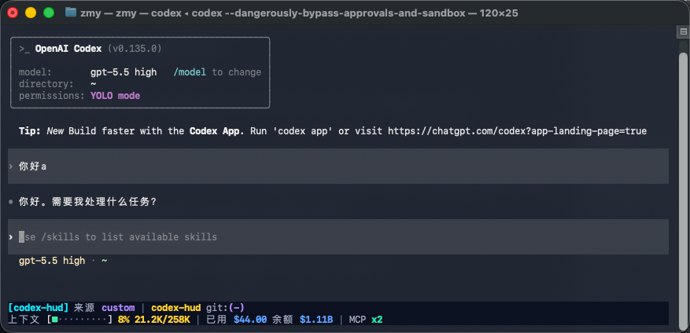
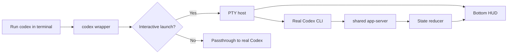

# codex-hud

<!-- README-I18N:START -->

**English** | [汉语](./README.zh.md)

<!-- README-I18N:END -->

`codex-hud` is a terminal HUD wrapper for Codex CLI. It does not fork Codex or modify Codex source code. Instead, when you run `codex`, it intercepts interactive launches, runs the real Codex CLI inside a child PTY, and renders a status bar at the bottom of the same terminal.

The current version focuses on macOS terminal environments. More terminal and platform compatibility will be added over time.

## Installation

Install with one command:

```bash
curl -fsSL https://raw.githubusercontent.com/subisle/codex-hud/main/install.sh | sh
```

Or install with Homebrew:

```bash
brew install subisle/tap/codex-hud
```

Manual release package install is also supported:

```bash
curl -L -o codex-hud-v0.1.0-aarch64-apple-darwin.tar.gz \
  https://github.com/subisle/codex-hud/releases/download/v0.1.0/codex-hud-v0.1.0-aarch64-apple-darwin.tar.gz
tar -xzf codex-hud-v0.1.0-aarch64-apple-darwin.tar.gz
cd codex-hud-v0.1.0-aarch64-apple-darwin
./install.sh ./codex
```

Confirm that both the wrapper and the real Codex CLI can be found:

```bash
which -a codex
```

`which -a codex` should resolve `~/.local/bin/codex` first, and the real Codex CLI should still appear later. This project is a wrapper, so the real Codex binary must remain later in `PATH`.

The default install location is `~/.local/bin/codex`. If your current shell still resolves Homebrew or another real Codex binary first, add this line to your shell config:

```bash
export PATH="$HOME/.local/bin:$PATH"
```

On macOS, `install.sh` runs ad-hoc codesign after copying the wrapper. This avoids the system rejecting the local binary as `Code Signature Invalid` and showing only `killed codex`.

## Ask Codex To Install It

If you already use Codex CLI, you can send this prompt directly to Codex:

```text
Please install codex-hud in the current macOS terminal.

Goals:
1. Install codex-hud with curl -fsSL https://raw.githubusercontent.com/subisle/codex-hud/main/install.sh | sh.
2. Confirm that install.sh downloads the latest macOS arm64 release package from https://github.com/subisle/codex-hud/releases.
3. After installation, confirm that the first result of which -a codex is ~/.local/bin/codex.
4. Confirm that which -a codex still finds the real Codex CLI later.
5. If ~/.local/bin is not in PATH, only provide the command that should be added to the shell config. Do not overwrite the real Codex.
6. After installation, run codex --help as a passthrough check.

Please first check whether the real Codex CLI and PATH are already configured on this machine before installing.
```

## What Is codex-hud?

`codex-hud` shows clearer status information below a Codex session:

| What you see | Why it helps |
| --- | --- |
| Project path | Know which repository you are in |
| Context | See whether the context is near its limit |
| Usage / rate limit | See current usage and remaining allowance |
| Git status | Know the current branch and dirty state |
| Tools / MCP | See tool calls and MCP activity |
| Thread / plan | Track the current conversation and plan progress |

## What It Looks Like



### Default Style

```text
[model] │ project git:(main*)
Context █████░░░░░ 45% │ Usage ██░░░░░░░░ 25%
```

- Line 1: model, project path, and git branch.
- Line 2: context bar and usage information.

### Optional Expansion

```text
◐ Edit: src/lib.rs | ✓ Read ×3 | ✓ Grep ×2
◐ explore [agent]: locating usage collector
▸ Fix launch fallback (2/5)
```

These expanded fields will continue to grow in later versions.

## How It Works



Core behavior:

- The wrapper only intercepts interactive `codex` launches.
- Non-interactive commands pass through directly.
- A shared local `app-server` avoids starting duplicate heavy state processes for every terminal.
- If HUD initialization fails, it falls back to plain Codex without blocking the main flow.

## Configuration

Default config path:

```text
${XDG_CONFIG_HOME}/codex-hud/config.toml
```

If `XDG_CONFIG_HOME` is not set, it uses:

```text
~/.config/codex-hud/config.toml
```

Example:

```toml
[daemon]
socket = "/tmp/codex-hud/app-server.sock"
auto_start = true
reuse_shared_daemon = true

[launcher]
enabled = true
auto_show_hud = true
surface = "inline-statusbar"
fallback_surface = "split"
bridge_listen = "ws://127.0.0.1:4500"
status_rows = 2
expanded_rows = 3

[display]
mode = "compact"
default_preset = "operator"
visible_sections = [
  "model",
  "cwd",
  "git_project",
  "git",
  "thread",
  "turn",
  "context",
  "rate",
]
show_account = false
show_goal = true
show_compaction = true
show_mcp_calls = true
settings_enabled = true

[quota]
enabled = false
usage_url = ""
api_key_env = "CODEX_HUD_QUOTA_API_KEY"
provider_label = "cc-switch"
timeout_secs = 10
poll_secs = 10
```

## Requirements

- A real Codex CLI installation.
- macOS terminals are the primary supported environment for now.
- The wrapper must appear before the real Codex in `PATH`.
- The real Codex must remain later in `PATH` so the wrapper can find it.

## Troubleshooting

### Running It Only Shows `killed codex`

macOS may directly kill a locally copied binary when its signature is invalid. First rerun the installer from the extracted release package:

```bash
./install.sh ./codex
```

If it still fails, manually re-sign it:

```bash
codesign --force --sign - "$HOME/.local/bin/codex"
```

Then verify:

```bash
PATH="$HOME/.local/bin:$PATH" codex --version
```

Expected output should look like:

```text
codex-cli 0.135.0
```

## Development

```bash
cargo fmt --check
cargo clippy --all-targets -- -D warnings
cargo test
```

Current test coverage:

- `tests/smoke.rs`: crate baseline.
- `tests/wrapper_args.rs`: command classification and real Codex discovery.
- `tests/link_unix.rs`, `tests/bridge_roundtrip.rs`: app-server transport and bridge.
- `tests/hud_render.rs`, `tests/hud_state.rs`: HUD rendering and state reduction.
- `tests/pty_layout.rs`, `tests/launcher_flow.rs`: PTY layout, launcher fallback, and exit codes.
- `tests/config.rs`: config paths and defaults.

## Roadmap

Next updates will add:

- More terminal compatibility.
- More robust fallback paths.
- More complete HUD fields.
- Clearer configuration and installation docs.

## License

MIT License. See [LICENSE](LICENSE).

### Unreleased - 2026-06-02

- Added a README screenshot showing the terminal HUD in a real Codex session.

### 0.1.0 - 2026-06-01

- Fixed macOS installs where the wrapper was killed by `SIGKILL (Code Signature Invalid)`.
- Fixed recursive launch risk caused by looking up the real Codex with the old `PATH`.
- Split launcher, PTY host, and HUD collector modules to reduce main entry complexity.
- Changed context display to use the model's real context window instead of incorrectly approaching 100%.
- Changed balance display to compact unit formatting and removed the balance progress bar.
