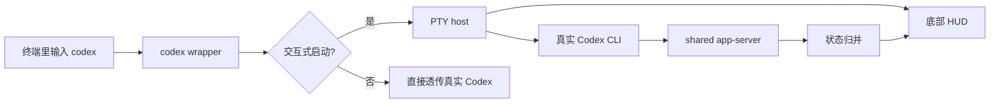

# codex-hud

<!-- README-I18N:START -->

[English](./README.md) | **汉语**

<!-- README-I18N:END -->

`codex-hud` 是一个给 Codex CLI 用的终端 HUD wrapper。它不 fork Codex，也不改 Codex 源码，而是在你输入 `codex` 时接管交互式启动，把真实 Codex 放进子 PTY 里，并在同一个终端底部显示状态栏。

当前阶段优先适配 macOS 终端环境，后续会持续补更多终端和平台兼容性。


## 安装

一行命令安装：

```bash
curl -fsSL https://raw.githubusercontent.com/subisle/codex-hud/main/install.sh | sh
```

也可以用 Homebrew 安装：

```bash
brew install subisle/tap/codex-hud
```

也支持手动使用 release 包安装：

```bash
curl -L -o codex-hud-v0.1.0-aarch64-apple-darwin.tar.gz \
  https://github.com/subisle/codex-hud/releases/download/v0.1.0/codex-hud-v0.1.0-aarch64-apple-darwin.tar.gz
tar -xzf codex-hud-v0.1.0-aarch64-apple-darwin.tar.gz
cd codex-hud-v0.1.0-aarch64-apple-darwin
./install.sh
```

确认 wrapper 和真实 Codex 都能被找到：

```bash
which -a codex
```

`which -a codex` 应该先命中 `~/.local/bin/codex`，后面还能看到真实 Codex CLI。这个项目是 wrapper，真实 Codex 必须仍在后续 `PATH` 中。

默认安装位置是 `~/.local/bin/codex`。如果当前 shell 仍优先命中 Homebrew 或其他真实 Codex，把下面这一行加入你的 shell 配置：

```bash
export PATH="$HOME/.local/bin:$PATH"
```

macOS 上 `install.sh` 会在复制 wrapper 后执行 ad-hoc codesign，避免系统把本地二进制判定为 `Code Signature Invalid` 并直接显示 `killed codex`。

## 让 Codex 帮你安装

如果你已经在用 Codex CLI，可以直接把下面这段提示词发给 Codex：

```text
请帮我在当前 macOS 终端安装 codex-hud。

目标：
1. 使用 curl -fsSL https://raw.githubusercontent.com/subisle/codex-hud/main/install.sh | sh 安装 codex-hud。
2. 确认 install.sh 会从 https://github.com/subisle/codex-hud/releases 下载最新 macOS arm64 release 包。
3. 安装后确认 which -a codex 的第一个结果是 ~/.local/bin/codex。
4. 确认 which -a codex 后面还能找到真实 Codex CLI。
5. 如果 ~/.local/bin 不在 PATH，请只给出需要添加到 shell 配置里的命令，不要覆盖真实 Codex。
6. 安装完成后运行 codex --help 做直通验证。

请先检查本机是否已有真实 Codex CLI 和 PATH 配置，再执行安装。
```

## 什么是 codex-hud？

`codex-hud` 会在 Codex 会话下方显示更清楚的状态信息：

| 看到什么 | 有什么用 |
| --- | --- |
| 项目路径 | 知道当前在哪个仓库里 |
| Context | 及时看到上下文是否接近上限 |
| Usage / rate limit | 看到当前限额和剩余情况 |
| Git 状态 | 知道当前分支和工作区是否脏 |
| Tools / MCP | 看见工具调用和 MCP 活动 |
| Thread / plan | 追踪当前会话和计划进度 |

## 你会看到什么

### 默认样式

```text
[model] │ project git:(main*)
Context █████░░░░░ 45% │ Usage ██░░░░░░░░ 25%
```

- 第 1 行：模型、项目路径、git 分支。
- 第 2 行：上下文条和限额信息。

### 可选扩展

```text
◐ Edit: src/lib.rs | ✓ Read ×3 | ✓ Grep ×2
◐ explore [agent]: locating usage collector
▸ Fix launch fallback (2/5)
```

这些扩展信息会随着后续版本持续增加。

## 它是怎么工作的



核心思路：

- wrapper 只接管交互式 `codex`。
- 非交互命令直接透传。
- 共享本地 `app-server`，避免每个窗口重复起重状态进程。
- HUD 初始化失败时回退到普通 Codex，不阻断主流程。

## 配置

默认配置路径：

```text
${XDG_CONFIG_HOME}/codex-hud/config.toml
```

如果没有设置 `XDG_CONFIG_HOME`，则使用：

```text
~/.config/codex-hud/config.toml
```

示例：

```toml
[daemon]
socket = "/tmp/codex-hud/app-server.sock"
auto_start = true
reuse_shared_daemon = true

[launcher]
enabled = true
auto_show_hud = true
surface = "inline-statusbar"
fallback_surface = "split"
bridge_listen = "ws://127.0.0.1:4500"
status_rows = 2
expanded_rows = 3

[display]
mode = "compact"
default_preset = "operator"
visible_sections = [
  "model",
  "cwd",
  "git_project",
  "git",
  "thread",
  "turn",
  "context",
  "rate",
]
show_account = false
show_goal = true
show_compaction = true
show_mcp_calls = true
settings_enabled = true

[quota]
enabled = false
usage_url = ""
api_key_env = "CODEX_HUD_QUOTA_API_KEY"
provider_label = "cc-switch"
timeout_secs = 10
poll_secs = 10
```

## 要求

- 已安装真实 Codex CLI。
- macOS 终端优先可用。
- `PATH` 中 wrapper 必须排在真实 Codex 前面。
- 真实 Codex 仍要留在后续 `PATH` 中，供 wrapper 查找。

## 排障

### 运行后只显示 `killed codex`

macOS 可能会因为本地复制后的二进制签名无效而直接杀掉进程。先在解压后的 release 包目录里重新运行安装脚本：

```bash
./install.sh ./codex
```

如果仍然失败，可以手动重签名：

```bash
codesign --force --sign - "$HOME/.local/bin/codex"
```

然后验证：

```bash
PATH="$HOME/.local/bin:$PATH" codex --version
```

正常输出应类似：

```text
codex-cli 0.135.0
```

## 开发

```bash
cargo fmt --check
cargo clippy --all-targets -- -D warnings
cargo test
```

当前测试覆盖：

- `tests/smoke.rs`：crate 基线。
- `tests/wrapper_args.rs`：命令分类和真实 Codex 查找。
- `tests/link_unix.rs`、`tests/bridge_roundtrip.rs`：app-server transport 和 bridge。
- `tests/hud_render.rs`、`tests/hud_state.rs`：HUD 渲染和状态归并。
- `tests/pty_layout.rs`、`tests/launcher_flow.rs`：PTY 布局、launcher fallback 和退出码。
- `tests/config.rs`：配置路径和默认值。

## 后续更新

后续会继续补：

- 更多终端兼容性。
- 更稳的 fallback 路径。
- 更完整的 HUD 字段。
- 更清晰的配置和安装说明。

## 许可证

MIT License. See [LICENSE](LICENSE).

### Unreleased - 2026-06-02

- 在 README 介绍区添加截图，展示真实 Codex 会话里的终端 HUD 效果。

### 0.1.0 - 2026-06-01

- 修复 macOS 安装后 wrapper 被 `SIGKILL (Code Signature Invalid)` 直接杀掉的问题。
- 修复 wrapper 查找真实 Codex 时仍使用旧 `PATH` 的递归风险。
- 拆分 launcher、PTY host 和 HUD 采集模块，降低主入口复杂度。
- 上下文显示改为使用模型真实 context window，避免错误接近 100%。
- 余额显示改为紧凑单位格式，并移除余额后的进度条。
